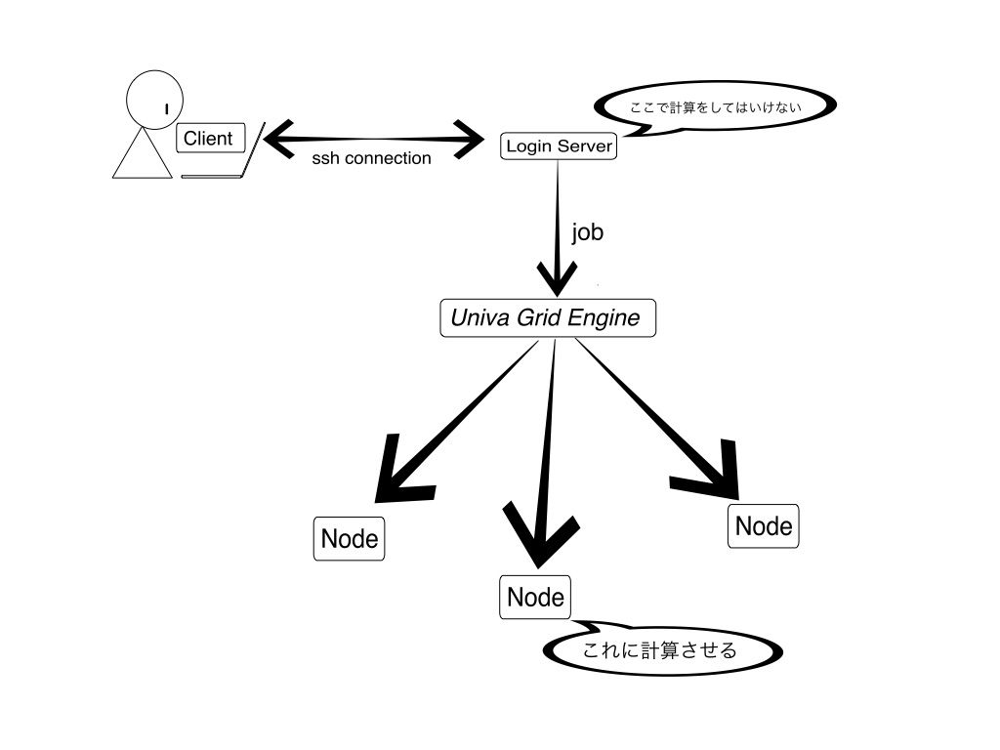

*リモートで作業するのは非常に難しいので、わからないこと・うまくいかないことが出てくると思います。[README](README.md)にも書きましたが、そういうときは`#computing`チャンネルで遠慮せずに訊いてください。うだうだ悩んでも時間の無駄、聞くは所詮一時の恥です！*

   * [サーバーに入るまで](#サーバーに入るまで)
      * [初心者の方へ](#初心者の方へ)
      * [サーバへのログイン](#サーバへのログイン)
         * [設定ファイル](#設定ファイル)
   * [サーバー内の仕組み](#サーバー内の仕組み)
      * [qstat](#qstat)
         * [State of Jobs（ジョブの状態）](#state-of-jobsジョブの状態)
         * [Priority(優先度)](#priority優先度)
      * [qhost](#qhost)
      * [qsub](#qsub)
         * [qsub-練習](#qsub-練習)
         * [キューの指定](#キューの指定)
      * [qdel](#qdel)
      * [qlogin](#qlogin)
         * [キューの指定-練習](#キューの指定-練習)
   * [環境構築](#環境構築)
      * [Singularity](#singularity)

# サーバーに入るまで
## 初心者の方へ

サーバーとのやり取りにはターミナル（黒い画面）を使うので、ある程度慣れておいてください。

* Q. ホームディレクトリ？パス？なにそれ？

    A. http://www.cc.kyoto-su.ac.jp/~hirai/text/path.html とかが参考になります。

* Q. 場所の移動とかコピーの方法がわからないよ！

    A.  http://www.ritsumei.ac.jp/~tomori/unix.html とかが参考になります。

* Q. ターミナルだとAtomとかVS CodeとかPyCharmが使えないじゃん！テキストエディタは何使えばいいの？

    A. **Vimにしましょう。いいね？**

ローカルで黒い画面をいじって慣れたら次に進みましょう。

## サーバへのログイン
サーバには`ssh`を使ってログインします。

* `which ssh`と打って、`ssh not found`と表示された人は残念ながら`ssh`が入っていないのでインストールしましょう。

sshとは、通信内容を暗号化して離れたところにあるサーバとターミナルでやり取りできるコマンドです（仕組みはここでは解説しないので知りたい人は調べてください）。

さて、そのために必要な暗号鍵を作らなければなりません。あなたのパソコンには`~/.ssh/id_rsa.pub`と`~/.ssh/id_rsa`がありますか？ない場合は、`ssh-keygen`を実行して新しい暗号鍵を作成しましょう。いろいろ聞かれますがエンター連打でOKです。

* なお、すでに上のファイルがある場合は**作成してはいけません**。既存の鍵が上書きされてしまうと戻せないので。

サーバーの管理者権限を持つ人（誰かわからなければ`#computing`チャンネルで訊いてください）に相談して、生成された`~/.ssh/id_rsa.pub`を教えましょう。

* **`.pub`のついていない方は他人に教えてはいけません**。教えてしまったら鍵生成のところからやり直しましょう（ちなみに`.pub`のついている方はいくら教えても大丈夫なので安心してください。ネットに公開したって何の問題もありません）。

`.pub`のついている鍵を鍵をサーバー側に登録する（管理者に登録してもらう）ことで`ssh`ができるようになります。

`ssh`のあとに続けるオプション(IPアドレスとかポートとかユーザー名とか)を指定してアクセスしましょう。

IPアドレス、ポート、ユーザー名の順に以下のように指定できます（これはダミーデータです！）。

```
ssh 114.514.191.981 -p 893 -l woody
```

### 設定ファイル
以上の内容を設定ファイルにまとめることもできます。

`~/.ssh/config`を
```
Host remote_server
    Hostname 114.514.191.981
    port 893
    user woody
```

とし（これもダミーデータです！）`ssh remote_server`しましょう。

# サーバー内の仕組み
こうして入ったサーバーですが、**ここで計算をしてはいけません**。ここはみんなで共有して使う場所なので、CPUをたくさん使うと他の人が重たくなって迷惑ですし、GPUはそもそも使えません。

ここから複数の計算用ノード（スパコン的なの）にアクセスできるようになっているので、そこで計算をするようにしましょう。



ノードの管理には、Univa Grid Engineというプログラムが使われています。
* 参考: https://supcom.hgc.jp/japanese/utili_info/manual/uge.html

これは、ノードの計算資源を配分してくれたり、使いすぎている人は自動で制限してくれるプログラムです。このプログラムに**ジョブ（仕事）**を依頼して、しばらく待つと（待たなくてもいいかもしれませんが）計算が実行されます。

依頼されたジョブは、**キュー**と呼ばれる列に並びます。飲食店にできる行列と一緒ですね。自分の番が来るまでそこで待つことになるわけです。

## qstat

`qstat`は（たぶん）queue statusの略で、キューの状態を表示してくれます。

* `qstat`とすると、キューに並んだ自分のジョブの一覧が表示されます。
    * 何も予約していない状態だと何も表示されません。

* `-f`オプションをつけると、全てのキューについて自分のジョブが（存在するならば）表示されます。
    * 何も予約していない状態だと全てのキューが出るのみです。

* `-u <ユーザー名>`オプションをつけると、そのユーザーのジョブの一覧が表示されます。
    *  `qstat -u '*'`とすると、全てのユーザーのジョブの一覧が表示されます。

* なので、上2つを組み合わせて`qstat -u '*' -f`とすると、全てのユーザーのジョブがキューごとに表示されます。

* `-ext`オプションをつけると、CPU・メモリなどの使用量を含め詳細な情報が表示されます。

* `qstat -j <ジョブID>`とすると、そのジョブの詳細な情報が表示されます。

その他にもさまざまなオプションがあるので、`man qstat`で読んでみましょう。
*   `man`では`less`というリーダー（テキストを読むためのプログラム）を使って読みますが、この操作はだいたいVimと一緒です。変なキーを押してなんかよくわからない状態になったら`ESC`で戻れて、`q`で終了します。

### State of Jobs（ジョブの状態）
ジョブの状態(state)に注目してみましょう。ジョブがうまく実行されているのかどうか見ることができます。

* E(rror)
    * 問題によりジョブが開始できなかった。`qstat -j <job_ID>`で詳しい原因が読めます。
    * `Eqw`と書かれることが多い。エラーによるキュー待機中。多分待ってもどうにもならないので、自己解決できそうにないなら`#computing`チャンネルにGO。
* w(aiting)
    * ジョブが待っている
    * `qw`はqueue waitingの略
* t(ransfering)
    * ジョブの実行が開始されようとしている
* r(unning)
    * ジョブが実行されている
    * このように、ジョブは**実行が終わるまでの間**キューに入っている。「飲食店の行列」に先程喩えたが、飲食店でご飯を食べている間は行列には並ばないので、この喩えはその点でちょっと不適切かも。
* s(uspended)
    * `qmod`コマンドによりジョブが一時停止されている

### Priority(優先度)
`qstat`では`prior`と表示されます。高いほど先に実行されます。さまざまな条件によって変わり、具体的には、

*   ジョブを提出したユーザー
*   ジョブのプロジェクト
*   ジョブの必要とするリソース
*   ジョブの提出時刻
*   （指定されていた場合は）ジョブの開始時刻の指定

によります(`man sge_priority`)。要するに使いすぎると止められる、けど大事なプロジェクトとかは管理者が指定して優先させられるってことです。

## qhost
計算機ノードを全て表示します。 

`qhost -q`でそれらのノードのキューの情報も表示し、`qhost -j`で更にジョブの一覧も表示します。

## qsub
`qsub`は、シェルスクリプトの形でジョブを提出できるコマンドです。queue submissionの略でしょう。

### qsub-練習
試しに、シェルスクリプトを書いて実行してもらいましょう。`test.sh`に
```
echo "nice"
echo "too bad" 1>&2
```
と書いて、`qsub test.sh`します。2行目は、`too bad`と標準エラー出力に書き出すコマンドです。

すると、ホームディレクトリに`test.sh.o<job_ID>`と`test.sh.e<job_ID>`が追加されていると思います。これらはそれぞれ、標準出力、標準エラー出力の結果です。

今回の場合、それぞれ`nice`と`too bad`と書き出されているはずです。

しかし、毎回ホームディレクトリにログが書き出されるとたまったものではないですね。その時は、`-cwd`オプションをつけて実行することでカレントディレクトリで実行することができます。したがってログファイルもカレントディレクトリに書き出されます。
```
#$ -cwd
echo "nice"
echo "too bad" 1>&2
```
のようにスクリプト内でオプションを指定しておくことも可能です。

### キューの指定
`qsub`および`qlogin`では、`-q <queue_name>`でキューを指定できます。`qstat -f`ででてくる`queuename`を入力すると、そのキューで実行/そのキューにログインするように指定できます。

特に指定しなければ空いているキューに自動でアサインしてくれるので、気にすることはないでしょう。キューの性能に依存する計算をする場合などでは使うことがあるかもしれませんね。

## qdel
`qdel <job_ID>`でジョブを消します。

## qlogin
`qlogin`は、計算用ノードのシェルにログインできるコマンドです。

インタラクティブに計算ノードに仕事をさせたいときに利用しましょう。

シェルからログアウトすると終了します。

### キューの指定-練習
誰も使っていないキューを一つ選び、そこに`qlogin`します。そこで`nvidia-smi`を実行し、搭載されているグラフィックボードのモデルを調べてみましょう。
*   別のグラボが搭載されているキューはありそうですか？
*   自分の使いたいモデル・データが乗るだけのメモリ量がグラボにあるでしょうか？

`nvcc --version`は実行できますか？
*   実行できない場合は`/usr/local/cuda/bin/nvcc --version`で試してみてください。
*   インストールされているCUDAのバージョンはいくつでしょうか。

# 環境構築
計算用ノードには、デフォルトでは最低限のプログラムしか入っていないので、TensorFlowやPytorchといったディープラーニングライブラリはおろかPython3すら入っていません。

この文章を読む人の多くがPythonを使ってディープラーニングしたい人だと思うので、その環境構築のやり方について説明しておきます。

なお、適当なキューに`qlogin`してから行うことをすすめます（そのまま計算に入ることができるので）。

ここでは例として、GPUが使用できる環境を構築してみます。

まずMinicondaを入れましょう。Python3やそのライブラリをインストールできます。

1.  `cd ~`

    `mkdir myenv`

    `cd myenv`
    * ホームに`myenv`ディレクトリを作成し、そこに移動します。
    * このディレクトリ内で環境づくりの作業をするだけなので、別に名前は何でもいいです。

2.  `wget https://repo.anaconda.com/miniconda/Miniconda3-latest-Linux-x86_64.sh`

    `bash ./Miniconda3-latest-Linux-x86_64.sh`
    * https://docs.conda.io/en/latest/miniconda.html のLinux 64-bit bash installerを落としてきて、実行します。
    * Minicondaインストーラーはもう消しても構いません(`rm Miniconda3-latest-Linux-x86_64.sh`)。
3. `export PATH="~/miniconda3/bin:$PATH"`
    * インストール場所をデフォルトから変えていなければ、`~/miniconda3/bin`に`python3`などが入っているはずなので、そこにパスを通します。
4. `conda install numpy`
    * もちろん`numpy`以外にもいろいろ落とせます。

## Singularity
`singularity`を使うと自前の環境を作ることができます。

*   Dockerでええやん、と思う人がいるかもしれませんが、Dockerを使うと必然的にroot権限がついてくるようで、共用サーバでroot権限をユーザに与えるのは危ないので使いません。[（参考:reddit）](https://www.reddit.com/r/docker/comments/7y2yp2/why_is_singularity_used_as_opposed_to_docker_in/)


1.  `singularity pull docker://tensorflow/tensorflow:latest-gpu`
    * GPU対応のUbuntuを落としてきます。
2. `singularity shell --nv ubuntu-latest.simg`
    * これで自前のubuntu環境に入れました！
    * `--nv`オプションはGPUを認識させるために必要です。
    * 環境に入ったら、`nvidia-smi`や`nvcc --version`などでGPUドライバやCUDAの調子を確かめてみましょう。GPUが認識されているはずです。
